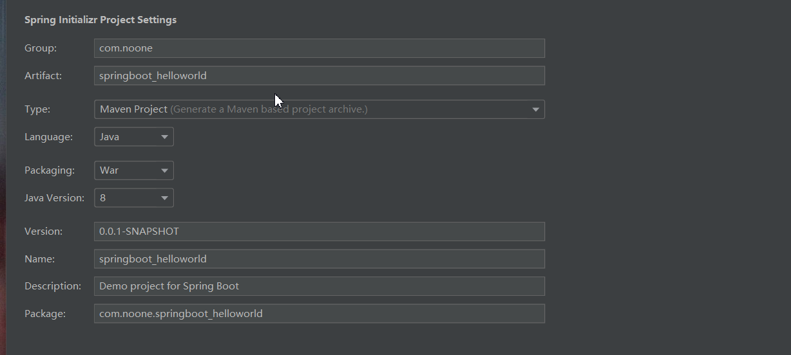
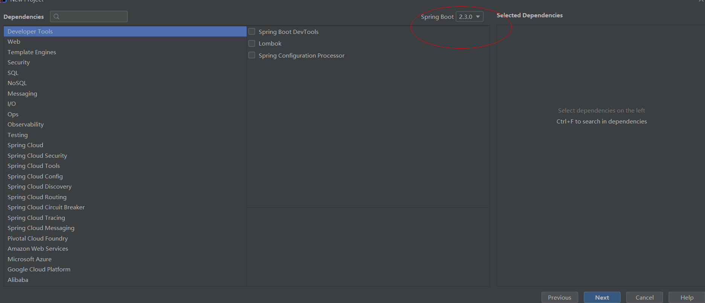
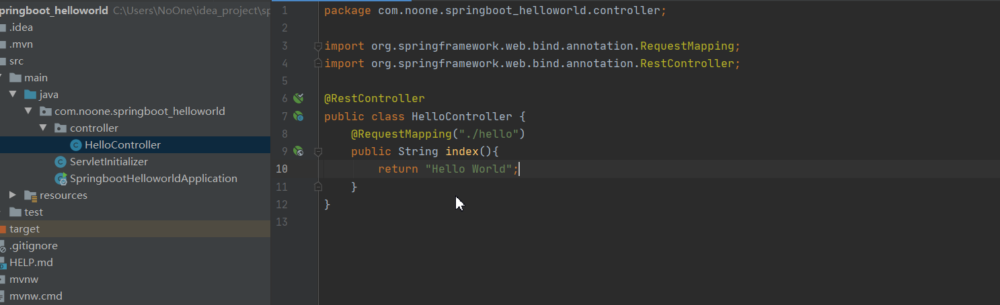
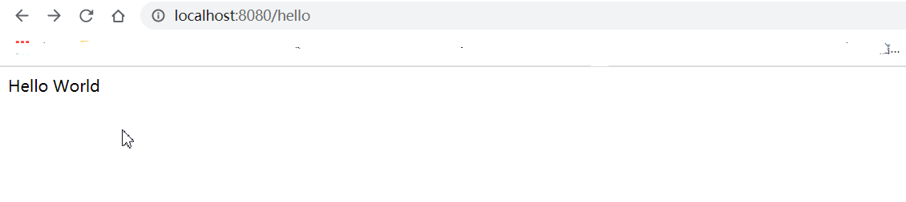

# SpringBoot-01-HelloWorld

创建过程

这里修改group, artifact,和packaging

下一步

这里我修改了版本,其余默认,next->next

然后等待下载完成, 这里没换源的话,经常会下载失败,记得先看chapter0进行换源过程

编写HelloController

启动springboot项目,访问8080端口,注意这里我图里打多个. 路径应该为/hello

这里hello world就成功了

