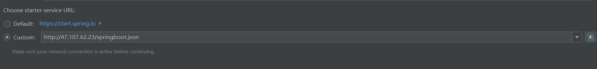
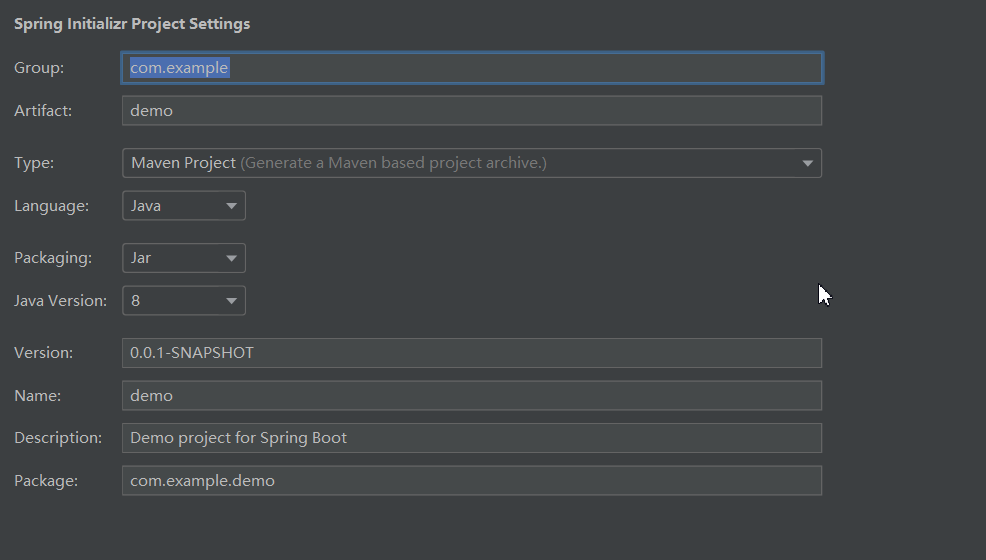

# 课前准备

[学习链接](https://www.bilibili.com/video/BV1mt411u7z1)

1. 安装IDEA
2. 修改setting.xml

路径

```
C:\Users\用户名\.m2\settings.xml
```

修改为

```xml
<?xml version="1.0" encoding="UTF-8"?>
<settings xmlns="http://maven.apache.org/SETTINGS/1.0.0"
          xmlns:xsi="http://www.w3.org/2001/XMLSchema-instance"
          xsi:schemaLocation="http://maven.apache.org/SETTINGS/1.0.0 http://maven.apache.org/xsd/settings-1.0.0.xsd">
    <mirrors>
        <mirror>
            <id>alimaven</id>
            <name>aliyun maven</name>
            <url>http://maven.aliyun.com/nexus/content/groups/public/</url>
            <mirrorOf>central</mirrorOf>
        </mirror>

        <mirror>
            <id>uk</id>
            <mirrorOf>central</mirrorOf>
            <name>Human Readable Name for this Mirror.</name>
            <url>http://uk.maven.org/maven2/</url>
        </mirror>

        <mirror>
            <id>CN</id>
            <name>OSChina Central</name>
            <url>http://maven.oschina.net/content/groups/public/</url>
            <mirrorOf>central</mirrorOf>
        </mirror>

        <mirror>
            <id>nexus</id>
            <name>internal nexus repository</name>
            <url>http://repo.maven.apache.org/maven2</url>
            <mirrorOf>central</mirrorOf>
        </mirror>

    </mirrors>
</settings>
```


然后重启idea即可


## 问题解决


Initialization failed for "https://start.spring.io" Please check URL,net work and proxy settings

网上说的方法都测了下

1. 代理 经测试不是代理的锅,他官网访问人数太多,高峰期无法正常访问
2. http问题,换成http也未解决

自行解决


抓包获取json自己搭建

http://47.107.62.23/springboot.json

然后填写该链接即可



这时候访问就可以了



同时,还可以将json部署到github上,就不用服务器了, 但是他还要下载包,所以这个方法没用, 经查阅资料可以本地搭建spring.io服务器, 自行百度搭建,github有项目

