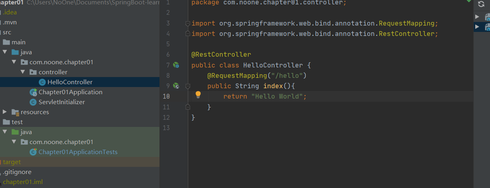
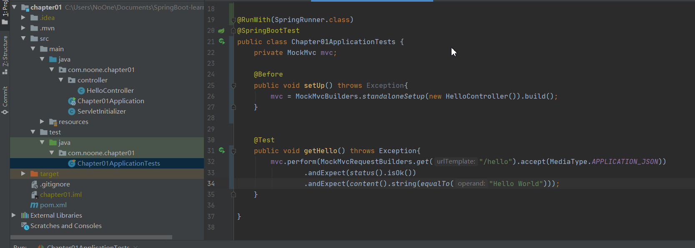
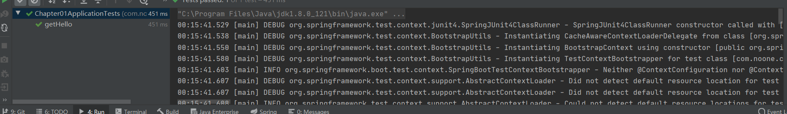

# chapter-01

注意这里选的是2.1.x版本, 用的2.3.x系列有些规范不怎么一样,会报错,建议同版本

这里编写第一个Hello World,并做但愿测试

创建一个包,编写控制器类

```java
@RestController
public class HelloController {
    @RequestMapping("/hello")
    public String index(){
        return "Hello World";
    }
}

```

看上去跟python一样简单,我喜欢



单元测试,记得导入三句话

```java
import static org.hamcrest.Matchers.equalTo;
import static org.springframework.test.web.servlet.result.MockMvcResultMatchers.content;
import static org.springframework.test.web.servlet.result.MockMvcResultMatchers.status;
```



单元测试通过



项目代码在chapter01里