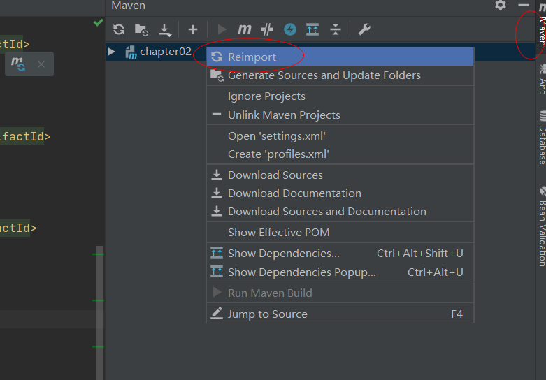
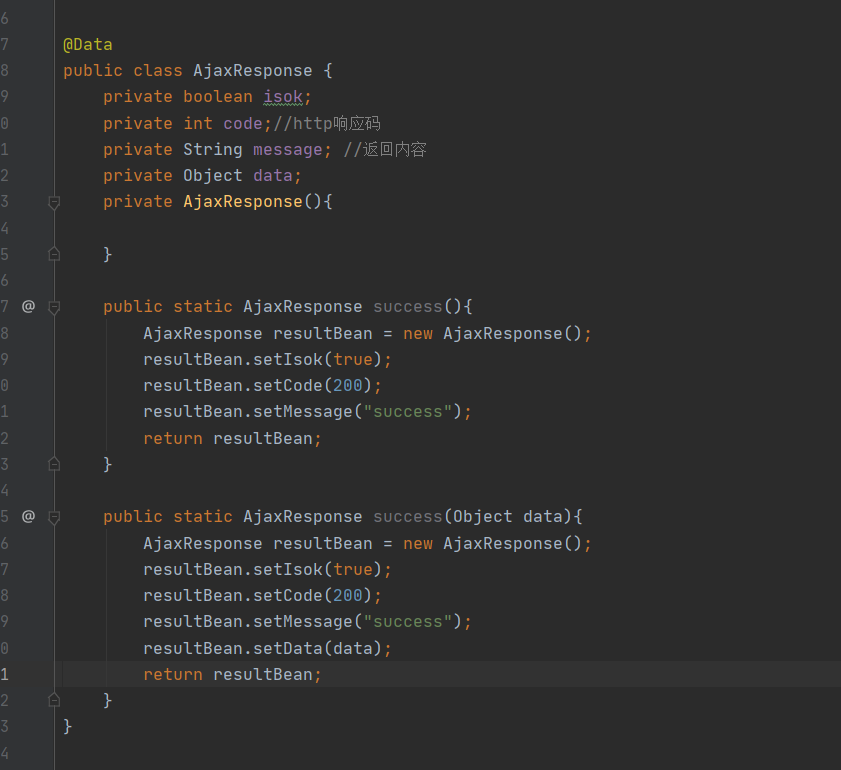
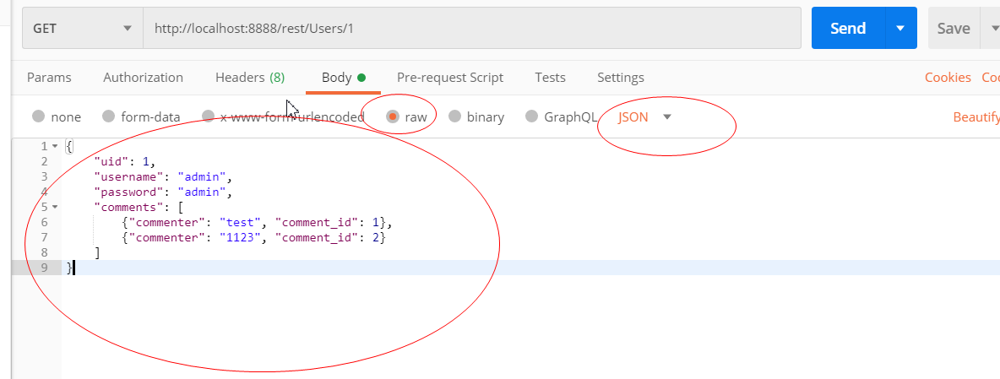
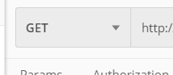
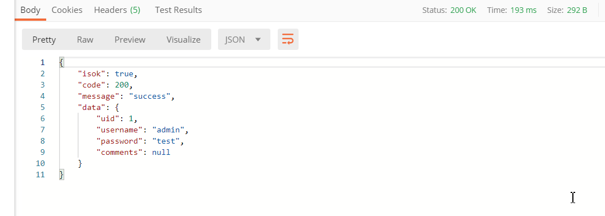

# RESTFul接口


## 规范

1. REST通过URL暴露资源时,会强调不要再URI中出现动词, 比如getDogs 而是用dogs
2. 用http方法方法体现对资源的操作(动词)
   - GET: 获取资源
   - POST: 添加资源
   - PUT: 修改资源
   - DELETE: 删除资源
3. HTTP状态码体现动作的结果
   - 200 OK
   - 400 Bad Request
   - 500 Internal Server Error
4. GET方法和查询参数不应该改变数据
5. 使用复数名词, 例如dogs而不是dog
6. 复杂资源关系的表达
   - GET /cars/711/drivers/ 返回使用car 711的所有司机
   - GET /cars/711/drivers/4 返回使用car 711的4号司机
7. HATEOAS 返回结果提供链接,使得用户不用查文档
8. 为集合提供过滤 排序 选择和分页
   - GET /cars?color=red
   - GET /cars?seats<=2
   - GET /cars?sort=-manufactorer, +model 多个字段排序
   - Field selection
   - 分页 page&limit
9. 版本化api   /api/v1/blog


## 常用注解开发RESTFul接口

这里首先安装个插件,这个插件会简化我们很多操作, 使用注解编译后会自动生成构造函数

Settings->Plugins->搜索lombok->安装->重启idea

添加依赖

```xml
        <dependency>
            <groupId>org.projectlombok</groupId>
            <artifactId>lombok</artifactId>
            <version>1.16.18</version>
            <scope>provided</scope>
        </dependency>
```



导入依赖


首先封装一个响应类



注意这里构造函数私有化了,至于为什么,细品,因为参数什么我们都不需要自己设置,我们直接需要返回一个对象即可


这里学到挺多的, RestController = Controller + ResponseBody

注解Slf4j可以直接日志

同时还有RequestMapping可以分为GETMapping等等,这样开发效率可以提高

```java
package com.noone.chapter02.controller;


import com.noone.chapter02.model.AjaxResponse;
import com.noone.chapter02.model.User;
import com.sun.deploy.net.HttpResponse;
import lombok.extern.slf4j.Slf4j;
import org.springframework.web.bind.annotation.*;

@RestController // = Controller + ResponseBody
@RequestMapping("/rest")
@Slf4j //log.info 打印日志
public class UserRestController {
    //@RequestMapping(value="/Users", method = RequestMethod.POST, produces = "application/json")
    @GetMapping("/Users")
    public AjaxResponse saveUser(){
        log.info("All");
        return AjaxResponse.success("23333");
    }

    @PostMapping("/Users/{id}")
    public AjaxResponse saveUser(@PathVariable Integer id, @RequestBody User user){
        user.setUid(id);
        log.info("updateUser: {}", id);
        return AjaxResponse.success(user);
    }

    //@RequestMapping(value="/Users/{id}", method = RequestMethod.DELETE, produces = "application/json")
    @DeleteMapping("/Users/{id}")
    public AjaxResponse deleteUser(@PathVariable Integer id){//PathVariable 就是跟/User/{id}这里对应的
        log.info("deleteUser: {}", id);
        return AjaxResponse.success(id);
    }

    //@RequestMapping(value="/Users/{id}", method = RequestMethod.PUT, produces = "application/json")
    @PutMapping("/Users/{id}")
    public AjaxResponse updateUser(@PathVariable Integer id, @RequestBody User user){
        user.setUid(id);
        log.info("updateUser: {}", id);
        return AjaxResponse.success(user);
    }

    //@RequestMapping(value="/Users/{id}", method= RequestMethod.GET, produces = "application/json")
    @GetMapping("/Users/{id}")
    public AjaxResponse getUser(@PathVariable Integer id){
        User user = User.builder().uid(1).username("admin").password("test").build();
        return AjaxResponse.success(user);
    }
}

```


下载postman测试



这里可以选择各种方法,

下面可以看到响应




