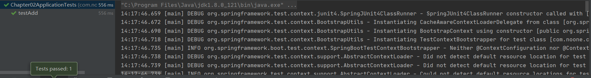
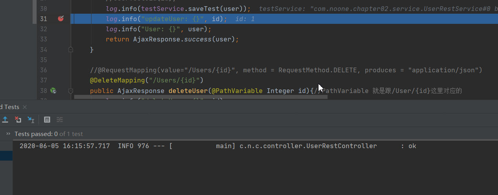

# Mockito编码 进行接口测试

Mock

在单元测试中,模拟对象可以模拟复杂的,真实的对象的行为, 如果真实的对象无法放入单元测试中,使用模拟对象就很有帮助


Mockito是github上使用最广泛的Mock框架,与Junit结合使用

发觉idea很强,当我复制json进去, 他自动帮我转换了

```json
{
	"uid": 1,
	"auther": "admin",
	"password": "admin",
	"comments": [
		{"commenter": "test", "comment_id": 1},
		{"commenter": "1123", "comment_id": 2}
	]
}
```

复制进去后

```java
        String myuser = "{\n" +
                "\t\"uid\": 1,\n" +
                "\t\"auther\": \"admin\",\n" +
                "\t\"password\": \"admin\",\n" +
                "\t\"comments\": [\n" +
                "\t\t{\"commenter\": \"test\", \"comment_id\": 1},\n" +
                "\t\t{\"commenter\": \"1123\", \"comment_id\": 2}\n" +
                "\t]\n" +
                "}";
    }
```

这里对项目02进行测试

```java
@RunWith(SpringRunner.class)
@SpringBootTest
@Slf4j
public class Chapter02ApplicationTests {

    private MockMvc mvc;

    @Before
    public void setUp() throws Exception{
        mvc = MockMvcBuilders.standaloneSetup(new UserRestController()).build();
    }

    @Test
    public void testAdd() throws Exception{
        String myuser = "{\n" +
                "\t\"uid\": 1,\n" +
                "\t\"username\": \"admin\",\n" +
                "\t\"password\": \"admin\",\n" +
                "\t\"comments\": [\n" +
                "\t\t{\"commenter\": \"test\", \"comment_id\": 1},\n" +
                "\t\t{\"commenter\": \"1123\", \"comment_id\": 2}\n" +
                "\t]\n" +
                "}";
        MvcResult result = mvc.perform(MockMvcRequestBuilders.request(HttpMethod.POST, "/rest/Users/1")
                .contentType("application/json").content(myuser))
                .andExpect(MockMvcResultMatchers.status().isOk())
                .andExpect(MockMvcResultMatchers.jsonPath("$.data.username").value("admin"))
                .andExpect(MockMvcResultMatchers.jsonPath("$.data.password").value("admin"))
                .andExpect(MockMvcResultMatchers.jsonPath("$.data.uid").value(1))
                .andReturn();
        log.info(result.getResponse().getContentAsString());
    }


```




@SpringBootTest

创建Spring的上下文ApplicationContext保证测试在上下文环境里运行


@Transactional

事务回滚, 操作数据库, 不要再Spring Boot集成测试中使用他


Mock方法

andExpect

andDo 要做的

andReturn 返回


```java
@AutoConfigureMockMvc
@Resource
    private MockMvc mvc;
这样就可以注入MoackMvc
```

注意RunWith(SpringRunner.class) 没有这个的话,在类里有依赖注入的话,会出错

这里有jackson的反序列化,以及打桩

```java
        ObjectMapper objectMapper = new ObjectMapper();
        User userObj = objectMapper.readValue(myuser, User.class);
        testService.saveTest(userObj);

        //打桩
        when(testService.saveTest(userObj)).thenReturn("ok");
```




mock可以模拟文件上传,模拟很多东西


## 总结

1. jackson反序列
2. 打桩
3. MockBean
4. 注解形式的MockMvc

