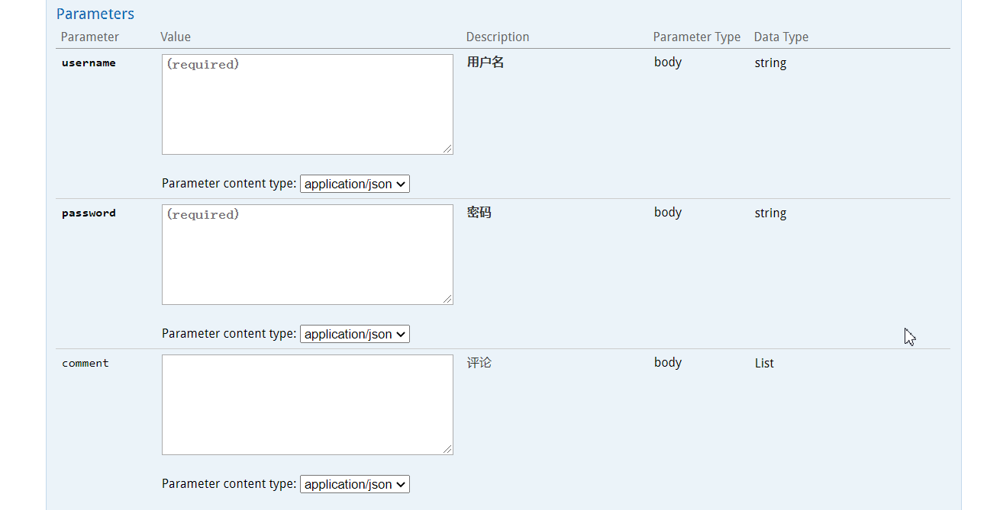
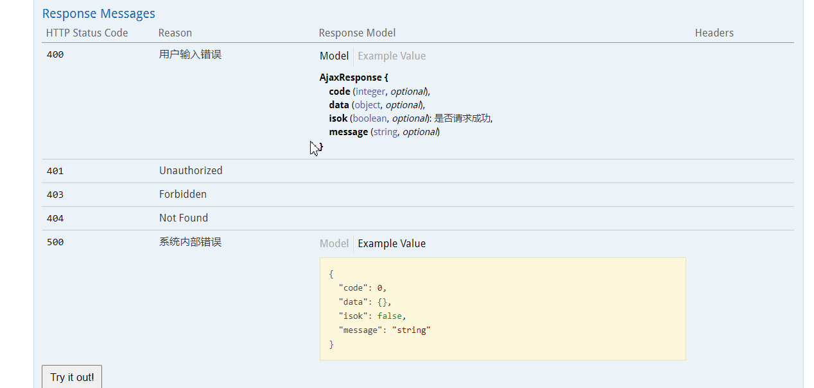
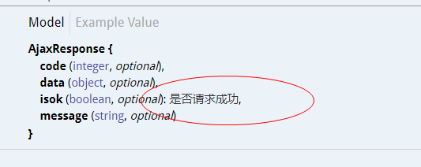

# swagger2构建发布api文档


创建类 config->Swagger2

```java
@Configuration
@EnableSwagger2
public class Swagger2 {
    @Bean
    public Docket createRestApi(){
        return new Docket(DocumentationType.SWAGGER_2)
                .apiInfo(apiInfo())
                .select()
                .apis(RequestHandlerSelectors.basePackage("com.noone.chapter02"))
                .paths(PathSelectors.regex("/rest/.*"))
                .build();
    }

    private ApiInfo apiInfo(){
        return new ApiInfoBuilder()
                .title("springboot利用swagger构建api文档")
                .description("简单优雅的restful风格")
                .termsOfServiceUrl("http://noonegroup.xyz")
                .version("1.0")
                .build();
    }
}
```

这里可以说是标准配置,指定包,一级指定模块需要生成api的部分

在Controller里可以添加注解,添加详细情况

```java
    @ApiOperation(value="添加用户", notes = "添加新的用户")
    @ApiImplicitParams({
            @ApiImplicitParam(name = "username", value="用户名", required = true),
            @ApiImplicitParam(name = "password", value="密码", required = true),
            @ApiImplicitParam(name="comment", value="评论", required = false, dataType = "List")
    })
    @ApiResponses({
            @ApiResponse(code=200, message="成功", response = AjaxResponse.class),
            @ApiResponse(code=400, message="用户输入错误", response = AjaxResponse.class),
            @ApiResponse(code=500, message = "系统内部错误", response = AjaxResponse.class)
    })
```

下图是ApiImplicitParam的效果



下图是ApiResponses的效果



同时还有ApiModel

```java
@ApiModel
public class AjaxResponse {
    @ApiModelProperty("是否请求成功")
    private boolean isok;
    private int code;//http响应码
    private String message; //返回内容
    private Object data;
    private AjaxResponse(){

    }

```



可以说生成的api文档很全面了