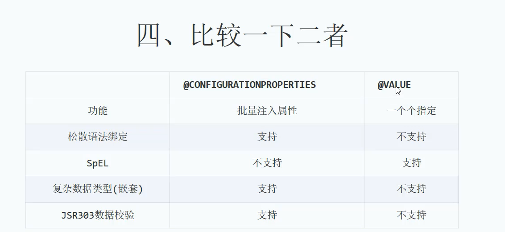

# YML配置

简单配置用Value

复杂配置用ConfigurationProperties

```java
@Data
@Component
@ConfigurationProperties(prefix = "family")
public class Family {
    //@Value("${family.family-name}")
    private String familyName;
    private Father father;
    private Mother mother;
    private Child child;
}

```

如果只需要修改familyName的值, 那直接用value

如果修改整体,则用ConfigurationProperties

yml

```yaml
family:
  family-name: "happy family"
  father:
    name: zimug
    age: 18
  mother:
    alias:
      - lovly
      - alice
  child:
    name: kobe
    age: 5
    friends:
      - hobby: football
        sex: male
      - hobby: baskball
        sex: female

server:
  port: 8888
```




# 数据校验

Validated验证

NotEmpty 不能为空校验

@size(min=6, max=20, message="密码长度只能在6-20之间")

@pattern 正则校验,类似检验邮箱

@Email

@NotNull

==